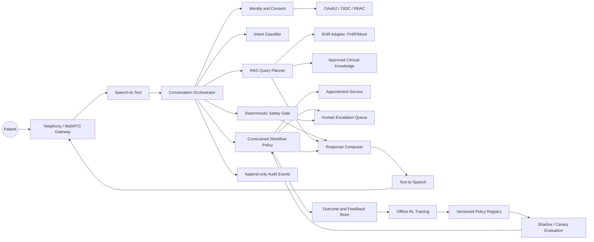
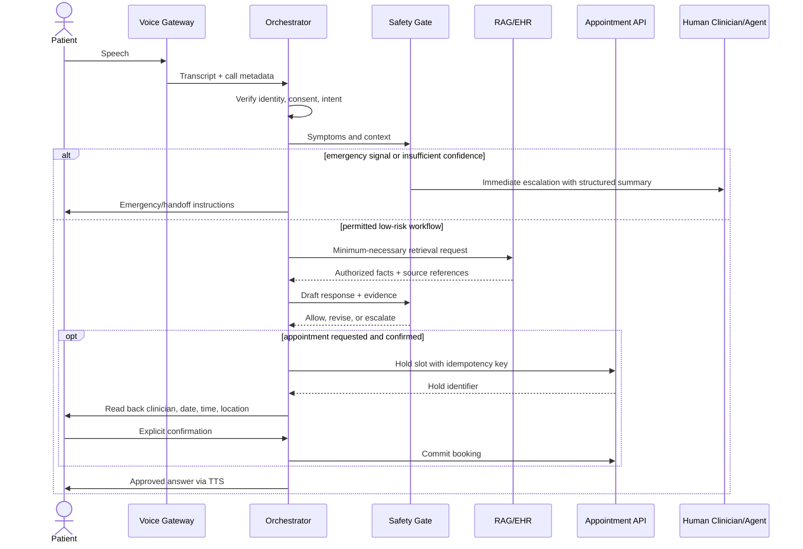

# Healthcare Agentic AI Architecture

## Safety premise

This is a research and engineering prototype, not a medical device. The LLM and
RL components never receive unrestricted authority to diagnose, prescribe,
delay emergency care, or mutate an EHR. Clinical guidance is grounded in an
approved knowledge base, checked by deterministic safety rules, and escalated
to qualified staff whenever risk or uncertainty exceeds configured thresholds.

Appropriate escalation is a successful safety action. It must not receive a
negative reward merely because a human became involved.

## System context



## Trust boundaries

1. **Public voice boundary:** telephony audio is untrusted input. Apply file-size,
   duration, codec, rate, abuse, and prompt-injection controls before processing.
2. **Identity boundary:** authentication, consent, and purpose-of-use are checked
   before any patient-specific retrieval.
3. **Clinical-data boundary:** the RAG planner receives a minimum necessary,
   time-limited EHR view instead of raw unrestricted records.
4. **Action boundary:** appointment mutations use idempotency keys, optimistic
   locking, authorization checks, and a final patient confirmation step.
5. **Learning boundary:** production conversations do not directly update the
   live policy. Data are de-identified, reviewed, and used for offline training.

## End-to-end interaction



## Reinforcement-learning boundary

### Permitted RL actions

- choose among pre-approved clarification questions;
- choose dialogue pacing and response brevity;
- rank safe appointment slots or channels;
- decide whether to offer a callback or human handoff earlier;
- optimize reminder timing within consented operational limits.

### Prohibited RL actions

- invent or alter emergency rules;
- diagnose, prescribe, or recommend dosage;
- suppress escalation to improve automation rate;
- access broader EHR fields than the authorization policy permits;
- book, cancel, or reschedule without explicit confirmation;
- learn online from a single live patient's outcome.

### Constrained objective

The policy maximizes service quality only within a hard admissible action set:

```text
maximize  E[task_success + patient_comprehension + booking_accuracy
            - avoidable_delay - unnecessary_turns]
subject to
    emergency_rule_violation = 0
    unauthorized_EHR_access = 0
    unconfirmed_booking_mutation = 0
    unsafe_clinical_statement = 0
    required_human_oversight = satisfied
```

Escalation reward is context-dependent: correct escalation is positive;
avoidable escalation may carry a small operational cost only after safety and
clinical-review labels confirm it was unnecessary.

## Deployment stages

1. Simulation with synthetic patients and mock EHR/appointment APIs.
2. Offline evaluation on de-identified, governance-approved data.
3. Silent shadow mode with no patient-facing or backend actions.
4. Staff-assist mode where a human approves every response and action.
5. Limited automation for administrative tasks only.
6. Any clinical expansion requires formal clinical validation, risk management,
   regulatory assessment, monitoring, rollback, and accountable human owners.
